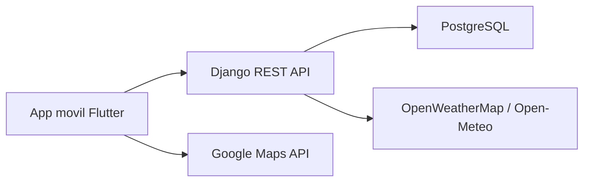
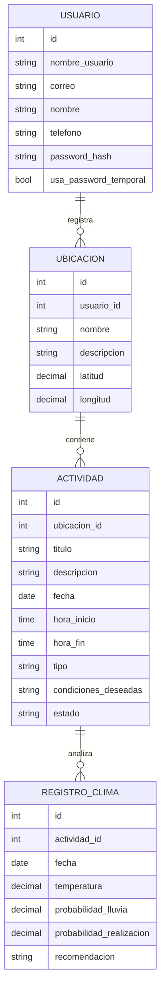

# Arquitectura propuesta

## Responsabilidad de cada tecnologia

| Tecnologia | Uso en el proyecto |
| --- | --- |
| Flutter | Pantallas, navegacion, formularios, dashboard y graficas |
| Dart | Logica de la app movil y calculos visuales |
| Django REST Framework | API para usuarios, ubicaciones, actividades y clima |
| PostgreSQL | Base de datos relacional para guardar la informacion |
| Google Maps API | Seleccion y visualizacion de ubicaciones |
| OpenWeatherMap | Pronostico real por coordenadas con API key |
| Open-Meteo | Respaldo de pronostico sin API key |

## Modelo de base de datos propuesto

## Endpoints iniciales de la API

| Metodo | Ruta | Proposito |
| --- | --- | --- |
| POST | `/api/auth/login/` | Validar credenciales |
| POST | `/api/auth/recuperar-password/` | Generar contrasena temporal |
| GET/PATCH | `/api/usuarios/me/` | Ver o editar perfil |
| GET/POST | `/api/ubicaciones/` | Listar o crear ubicaciones |
| GET/PATCH/DELETE | `/api/ubicaciones/{id}/` | Editar o eliminar ubicacion |
| GET/POST | `/api/actividades/` | Listar o crear actividades |
| GET/PATCH/DELETE | `/api/actividades/{id}/` | Editar o eliminar actividad |
| GET | `/api/actividades/pendientes/` | Listar actividades proximas |
| GET | `/api/estadistica/{actividad_id}/` | Calcular Bayes y resumen climatico |

## Servicio de clima en el avance

En el prototipo Flutter, el clima ya se consulta directamente desde OpenWeatherMap usando las coordenadas de la ubicacion seleccionada. Si no existe API key o la consulta falla, la app usa Open-Meteo como respaldo. Para la entrega final, esta consulta puede moverse al backend en Django para centralizar reglas, auditoria y persistencia de resultados climaticos.

## Lo que se puede defender como avance

El avance visual demuestra que ya esta definido el flujo de usuario y la estructura de modulos. Tambien se incluye una propuesta concreta de base de datos, endpoints y logica estadistica. La implementacion final trasladara estas pantallas a Flutter y conectara la app con Django REST Framework y PostgreSQL.
